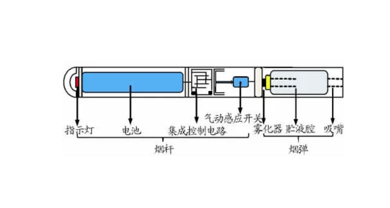
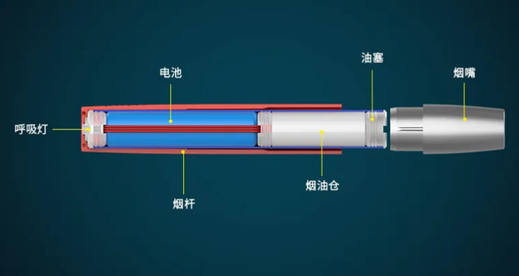

## 电子烟百度百科

[电子烟百度百科](https://baike.baidu.com/item/%E7%94%B5%E5%AD%90%E9%A6%99%E7%83%9F/7731234?fr=aladdin)

## 各国电子烟监管思路

| 序号 | 国家和地区 | 监管思路                                                     |
| ---- | ---------- | ------------------------------------------------------------ |
| 1    | 日本       | 将电子烟作为**药品**监管，禁止市场自由流动。                 |
| 2    | 美国       | 将电子烟纳入**烟草**制品监管，通过FDA审批才能上市。          |
| 3    | 德国       | 将电子烟作为**烟草**制品进行监管，较为轻松，对宣传有较小限制。 |
| 4    | 英国       | 将电子烟作为**消费品或药品**进行监管(税率不同)，并在宣传包装方面进行一定限制。 |
| 5    | 韩国       | 将**不含尼古丁**电子烟作为**消费品**监管，将**含尼古丁**电子烟作为**烟草**制品监管。 |
| 6    | 意大利     | 将电子烟作为**烟草**制品进行监管，符合规定可以上市销售。     |
| 7    | 巴西       | 将全部电子烟作为**烟草**制品监管，禁止上市销售。             |
| 8    | 沙特阿拉伯 | 禁止销售电子烟。                                             |

## 中国电子烟政策

| 时间       | 政策                                         | 主要内容                                                     |
| ---------- | -------------------------------------------- | ------------------------------------------------------------ |
| 2018年8月  | 《关于禁止向未成年人出售电子烟的通告》       | 国家市场监督管理总局和国家烟草专卖局要求国内市场不得向未成年人销售电子烟 |
| 2019年11月 | 《关于进一步保护未成年免受电子烟侵害的通告》 | 《通告》要求各类市场主体不得向未成年人销售电子烟。督促电子烟生产、销售企业或个人及时关闭电子烟互联网销售网站或客户端，电商平台及时关闭电子烟店铺并将电子烟产品及时下架，电子烟生产、销售企业或个人撤回通过互联网发布的电子烟广告。 |
| 2020年7月  | 《关于印发电子烟市场专项检查行动方案的通知》 | 开展互联网电子烟信息全面清理、电子烟实体店全面检查、电子烟自动售卖机等新型渠道全面检查。本次专项检查行动自2020年7月10日至9月10日，为期两个月。 |
| 2020年10月 | 《未成年人保护法》                           | 第十七条第四项规定，未成年人的父母或者其他监护人不得放任、唆使未成人吸烟(含电子烟，下同)、饮酒、赌博、流浪乞讨或者欺凌他人。同时，基于本法第十七条第四项的规定，在禁止向未成年人销售烟的条款(第五十九条)中也包含了对电子烟的管制。 |
| 2022年3月  | 新规                                         | [内容](https://baijiahao.baidu.com/s?id=1730002155687660480&wfr=spider&for=pc) |

## 电子烟原理

[电子烟原理](https://baijiahao.baidu.com/s?id=1736297184446411323)

## [电子烟雾的主要成分](http://www.cd120.com/public/affairs/rewards4/60225.html)

1. 甘油

   **甘油**在生活中非常常见，作为食用甘油是安全的，但若甘油含有杂质较高的时候，这些杂质要么堆积在发热丝上面形成沉积，要么随着蒸汽进入肺部，进入肺部后可能对支气管粘膜产生刺激甚至滞留在支气管粘膜之中，这可能是很多人使用电子烟后觉得嗓子痒的原因之一。

2. 丙二醇

   **丙二醇**在工业中主要作为防冻剂，加湿剂和食品添加剂，在符合国家规定的条件下，食用是安全的，但作为烟雾吸入大量丙二醇会对呼吸道产生刺激（有点像尼古丁的击喉感）。虽然丙二醇作为液体是可以随着呼吸系统挥发的，但这种间歇刺激对健康的长期影响目前没有定论。

3. 调味香料和香精

   **调味香料和香精**均是有机化合物，每款烟油里面涉及的香精成分可能多达几百种。植物提取物中存在碳纤维微粒，在加热时，会成为碳微粒随着烟雾吸入肺中，还有一部分氧化成为一氧化碳和二氧化碳。另外，不同香精之间可能产生化学反应生成不明物质，这种不明物质在加热条件下可能会生成有害物质。已有研究表明至少有65中香精在加热后可产生有毒物质，并对呼吸系统、心血管循环系统、骨骼系统和皮肤产生影响。

4. 尼古丁

   **尼古丁**的浓度在电子烟中是可调的，值得注意的是近两年在电子烟行业中出现了使用尼古丁盐替代了尼古丁的使用，尼古丁盐的吸入时的不适反应相比于游离碱尼古丁更少，且更加稳定、易于溶解，导致目前市面上电子烟液中的尼古丁含量可高达60 mg/mL甚至更高，因此可能促进消费者（特别是青年人）提高尼古丁的吸入量并导致成瘾性和依赖性。

5. 加热雾化芯材料加热后的产物

   **加热雾化芯材料加热后的产物**，不同产品可能使用了不同加热雾化芯材料，分为发热丝和导油棉，其中常见的发热丝材料包括：Kanthal（铁铬铝合金）、Ni60/Ni80（镍铬合金，含60%镍或者80%镍，也叫Nichrome）、Ni200（一般称为纯镍丝）、Ti（钛金）、SS316（316不锈钢）等，导油棉的材料包括陶瓷芯、棉芯、玻璃纤维等，这些材料在加热氧化后可能会释放出一些有害物质，和烟雾一起被吸入肺内。

6. 可能的生物污染

   **可能的生物污染**，电子烟中的有机物可能会遭遇生物污染（细菌、病毒等），电子烟油宣称的保质期一般在一年以上，若厂家未严格进行无菌灌装、或超过保质期、或开封后未及时使用，均可能导致生物污染。这些细菌或病毒在加热时不一定会被高温杀死，它们可能随着雾气进入肺内产生感染。

## 电子烟与普通烟的区别

**燃烧vs雾化**

传统烟草需要燃烧才可以抽吸，烟草经燃烧后，会产生大量有害物质。其中包括焦油，焦油是有机物在缺氧条件下不完全燃烧的产物，包含多种致癌物质和多种促癌物质，因此普通烟草被WHO列为一类致癌物。此外，焦油还会促使人体血管逐步硬化丧失弹性，从而导致心血管疾病等。然而电子烟并不燃烧，而是加热雾化，其气溶胶烟雾不含有焦油。电子烟一般雾化温度控制在250-350℃，这个温度相对于普通烟草的700-800℃要低的多，可降低有害物质生成。

**烟vs雾**

固体颗粒物的生成也是重要的区别。传统烟草的燃烧会产生大量的固体悬浮颗粒物，从PM1.0-PM10都有，这些固体颗粒被吸进人体，粘附在喉咙、气管、肺部等地方沉积，是无法分解的，长年累月下来，就会诱发喉癌、气管癌、肺癌等不可挽回疾病。而电子烟烟液雾化后产生的颗粒，固体颗粒含量很少，主要以气溶胶或液态颗粒为主，进入人体后会被吸收或排除，从这个角度说，电子烟的危害也传统烟草小。

**成分的区别**

传统烟草燃烧或不完全燃烧后产生的有害物质包括，尼古丁、亚甲基亚硝胺（NNAL）、丙烯腈、镉、萘、芘等易致瘾、致病或致癌的物质，这些物质虽然在电子烟雾中并不能完全避免，但浓度要低很多。然而，电子烟雾相对比传统烟草出现的新成分包括各种溶解剂和稀释剂比如植物甘油、丙二醇、丙三醇等，用于调节口感的食用香精，可能存在潜在的危害。

## 电子烟的可能危害有哪些？

随着电子烟市场的扩大和成分的改变，来自公共卫生安全领域的最新专家意见认为电子烟的危害需得到重视]：

1、目前市面上流行有数千种加入调味剂的电子烟口味，这些化合物对呼吸系统是否有毒性并不清楚。另外，质子化尼古丁（尼古丁盐）的大量使用，使得目前市面上电子烟液中的尼古丁含量可高达60毫克/毫升，因此可能促进消费者提高尼古丁吸入量及其依赖性。

2、电子烟液体中包括挥发性醛类物质，包括甲醛、乙醛、乙烯醇等，对心血管和呼吸系统具有毒性效应。

3、电子烟在青少年和青年人中的流行，电子烟中尼古丁和大麻浓度的提升，可能提高这些潜在吸烟者的成瘾性和使用传统烟草的概率。

4、电子烟与传统烟草所含有毒物质确有区别，但其毒副作用还与各自的使用方法和使用量有关，不能说电子烟中所含的有毒物质种类少，它便无害。

5、电子烟的市场规范仍不完善，不同国家、不同厂商的不同产品种类，其技术不同、成分不一，这也为电子烟健康危害的评估带来了困难。

## 电子烟常见问题

[常见问题](https://www.maigoo.com/goomai/109806.html)

